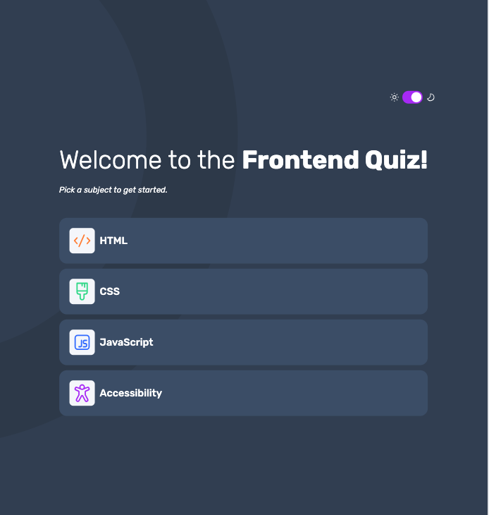

# Frontend Mentor - Frontend Quiz App Solution

This is my solution to the [Frontend quiz app challenge on Frontend Mentor](https://www.frontendmentor.io/challenges/frontend-quiz-app-BE7xkzXQnU).  
Frontend Mentor challenges help you improve your coding skills by building realistic projects.

## Overview

### The challenge

Users should be able to:

- Select a quiz subject
- Select a single answer from each question from a choice of four
- See an error message when trying to submit an answer without making a selection
- See if they have made a correct or incorrect choice when they submit an answer
- Move on to the next question after seeing the question result
- See a completed state with the score after the final question
- Play again to choose another subject
- View the optimal layout for the interface depending on their device's screen size
- See hover and focus states for all interactive elements on the page
- Navigate the entire app only using their keyboard
- **Bonus**: Change the app's theme between light and dark

### Screenshot

### Links

- Solution URL: [GitHub Repository](https://github.com/Bruchno/Frontend-Quiz-app)
- Live Site URL: [Live Demo](https://bruchno.github.io/Frontend-Quiz-app/)

## My process

### Built with

- Semantic HTML5 markup
- CSS custom properties
- Flexbox
- CSS Grid
- Mobile-first workflow
- Vanilla JavaScript (no external libraries)

> Note: I deliberately avoided using JavaScript libraries to keep the app lightweight and responsive. Even the progress bar was built manually.

### What I learned

Working on this project helped me practice structuring a quiz application without relying on frameworks. I reinforced my knowledge of:

- Handling state and user interactions with plain JavaScript
- Creating accessible layouts with semantic HTML and CSS Grid/Flexbox
- Managing focus and keyboard navigation for better accessibility

### Continued development

I plan to continue refining:

- Accessibility features (keyboard navigation, ARIA attributes)
- Improving responsiveness and testing across more devices
- Adding more quiz subjects and questions

### Personal note

There was a long delay between building the site and publishing it on GitHub due to personal circumstances. Living through war and personal losses made it difficult to focus on coding. I apologize if the app does not work perfectly in all cases, but I hope it still demonstrates my effort and learning.

## Author

- GitHub - [Bruchno](https://github.com/Bruchno)
- Frontend Mentor - [@Bruchno](https://www.frontendmentor.io/profile/Bruchno)